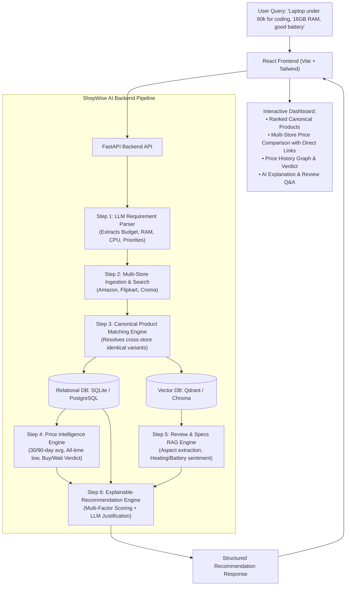

# ShopWise AI — Complete Project Workflow & Implementation Guide

## 1. Overall Tech Stack

### Frontend
- **Framework**: React 18 / 19 with **Vite** (Fast, modern build tool)
- **Language**: TypeScript / JavaScript (ES6+)
- **Styling**: Tailwind CSS (Clean, responsive modern e-commerce dashboard design)
- **Icons**: Lucide React
- **Data Visualization**: Recharts (Interactive price history line & trend charts)
- **HTTP Client**: Axios / Native Fetch
- **State Management**: React Context / Hooks

### Backend
- **Framework**: FastAPI (High-performance, asynchronous Python REST API framework)
- **Language**: Python 3.10+
- **Data Validation & Serialization**: Pydantic v2
- **ORM / Database Access**: SQLAlchemy 2.0 + Alembic (Migrations)
- **Data Processing & Analytics**: Pandas + NumPy (Moving averages, volatility, price trend calculations)

### Databases & Storage
- **Relational Database**: SQLite (for zero-config local development, seamlessly switchable to PostgreSQL via SQLAlchemy connection string)
  - *Stores*: Canonical Products, Product Variants, Store Listings, Historical Prices, User Preferences.
- **Vector Database**: Qdrant / ChromaDB
  - *Stores*: Product review embeddings, specification chunks, aspect-based sentiment metadata.

### AI / LLM & RAG Engine
- **LLM Provider**: Google Gemini API (`gemini-1.5-flash` / `gemini-1.5-pro` or OpenAI)
- **Embedding Model**: Gemini Text Embeddings / HuggingFace `all-MiniLM-L6-v2`
- **RAG Orchestration**: Custom modular RAG pipeline for clear, explainable, interview-ready code.

---

## 2. System Architecture & Workflow Diagram



---

## 3. Step-by-Step Implementation Roadmap

---

### Step 1: Environment Setup & Project Scaffolding
**Goal**: Establish the workspace directory structure, virtual environment, dependencies, and baseline endpoints for both Backend and Frontend.

**What we will do**:
1. Create a clean modular directory structure:
   - `backend/`: FastAPI application, configuration, database, services, routers.
   - `frontend/`: Vite + React + Tailwind application.
2. Initialize Python virtual environment and install backend packages (`fastapi`, `uvicorn`, `pydantic`, `sqlalchemy`, `pandas`, `numpy`, `google-generativeai`, `chromadb`/`qdrant-client`, `python-dotenv`).
3. Setup the Vite React frontend with Tailwind CSS, Lucide icons, and Recharts.
4. Configure `.env` files for environment variables (Gemini API key, DB URLs, port configs).

**Deliverable & Verification**:
- Backend running at `http://localhost:8000/api/health` returning `{ "status": "ok" }`.
- Frontend running at `http://localhost:5173` showing the ShopWise AI base layout.

---

### Step 2: Database Schema & Relational Data Modeling
**Goal**: Design and implement the relational database schemas for structured e-commerce data.

**What we will do**:
1. Define SQLAlchemy models:
   - `CanonicalProduct`: Master product entity (e.g., *Lenovo IdeaPad Slim 3*).
   - `ProductVariant`: Specific configuration (e.g., *16GB RAM, 512GB SSD, Intel i5 13th Gen, Arctic Grey*).
   - `Store`: Supported platforms (*Amazon, Flipkart, Croma, HP Store*).
   - `StoreListing`: Real platform listing linked to a variant (*Store ID, Store Product URL, Current Price, In Stock, Rating, Total Reviews, SKU/ASIN*).
   - `PriceHistoryRecord`: Historical price logs (*Listing ID, Timestamp, Price, Discount Percentage*).
2. Create Pydantic v2 schemas for request validation and clean API serialization.
3. Write database initialization and session management utilities.

**Deliverable & Verification**:
- Database tables created and verified with automated test queries.

---

### Step 3: Multi-Store Data Adapters & Seed Data Pipeline
**Goal**: Implement an extensible data ingestion layer that simulates/retrieves multi-store product listings and price logs.

**What we will do**:
1. Build a `BaseStoreAdapter` abstract interface with methods `search_products()`, `get_product_details()`, `get_price_history()`.
2. Implement concrete adapters for:
   - `AmazonAdapter`
   - `FlipkartAdapter`
   - `CromaAdapter`
3. Create a realistic, rich seed dataset spanning multiple categories (Laptops, Smartphones, Audio/Headphones, Smartwatches) with:
   - Multi-store price variations for the same items.
   - 90-day realistic historical price trends (price spikes, sales, all-time lows).
   - Verified customer reviews with diverse sentiment (battery, heating, performance, build).

**Deliverable & Verification**:
- Seed script populating the database with realistic multi-store product catalogs and price history.

---

### Step 4: Product Normalization & Canonical Entity Matching
**Goal**: Solve the core problem of matching differing product titles across stores into one unified Canonical Product.

**What we will do**:
1. Implement title cleaning and token extraction (brand, model family, CPU, RAM, storage, color).
2. Build a similarity scoring & entity resolution algorithm (combining fuzzy matching, regex spec extraction, and token overlap).
3. Ensure variants are strictly isolated (e.g., 8GB RAM is never mistakenly matched to a 16GB RAM model).
4. Group multi-store listings under single canonical product cards with side-by-side store prices and direct URLs.

**Deliverable & Verification**:
- Unit tests verifying that *"JBL Tune 770NC Wireless Headphones"* (Amazon) and *"JBL Tune 770NC ANC Black"* (Flipkart) correctly resolve to the same canonical product.

---

### Step 5: Price Intelligence & Trend Analytics Engine
**Goal**: Transform raw historical prices into actionable shopping advice using Pandas and statistical modeling.

**What we will do**:
1. Build a `PriceAnalyticsService` that computes:
   - **Current Lowest Price** across all stores.
   - **30-Day & 90-Day Moving Average Price**.
   - **Historical Minimum (All-Time Low)** & **Historical Maximum**.
   - **Price Drop Percentage** relative to average.
   - **Price Volatility & Trend Direction** (Upward, Downward, Stable).
2. Implement the rule-based Verdict Engine:
   - 🟢 **BUY NOW**: Current price is near all-time low (within 3%) or significantly below 90-day average (>10% drop).
   - 🟡 **GOOD / FAIR PRICE**: Current price is around the average price (±5%).
   - 🔴 **WAIT**: Current price is above the 90-day average or recent price hike detected.

**Deliverable & Verification**:
- API endpoint `/api/analytics/price/{variant_id}` returning full statistical summary, trend graph data points, and verdict badge.

---

### Step 6: Review Ingestion & Semantic Vector RAG Pipeline
**Goal**: Build a semantic RAG pipeline over customer reviews to extract authentic pros, cons, aspect sentiments, and answer user questions.

**What we will do**:
1. Configure the Vector Database (Qdrant / Chroma).
2. Implement review chunking and embedding pipeline (using Gemini Embeddings or HuggingFace).
3. Index customer reviews tagged with metadata (`product_id`, `store`, `rating`, `aspect`).
4. Implement **Aspect-Based Sentiment Extraction**:
   - Automatically summarize key aspects (e.g., Battery: Positive 88%, Heating: Negative 40%, Performance: Positive 95%).
5. Build an **Interactive Product Q&A Endpoint**:
   - Allows users to ask specific questions about a product (e.g., *"Does this laptop get hot during long coding sessions?"*).
   - Retrieves top matching review chunks and generates a grounded, cited answer.

**Deliverable & Verification**:
- Vector store populated with reviews; test query successfully retrieves relevant review excerpts and generates a grounded response.

---

### Step 7: LLM Requirement Parser & Explainable Recommendation Engine
**Goal**: Parse natural language user intent and generate transparent, multi-factor ranked recommendations.

**What we will do**:
1. Implement `RequirementParserService` using LLM structured output:
   - Extracts `category`, `budget_max`, `required_specs` (RAM, storage, screen size), `primary_use` (e.g. coding, gaming, office), and priority weights.
2. Build the **Hybrid Scoring Algorithm**:
   $$\text{Score} = w_1(\text{Specs Fit}) + w_2(\text{Budget Fit}) + w_3(\text{Price Value}) + w_4(\text{Review Sentiment})$$
3. Build the **Explainable Recommendation Generator (LLM)**:
   - Explains **Why #1 was chosen** (matched specs, price below 90-day average, high developer review score).
   - Highlights **Potential Concerns** (trade-offs from reviews).
   - Provides **"Why not Product B / C?"** comparative contrast.

**Deliverable & Verification**:
- API endpoint `/api/recommend` taking raw query text and returning parsed filters, ranked canonical products, price verdicts, and explainable markdown justifications.

---

### Step 8: Interactive React Frontend Dashboard
**Goal**: Build an intuitive, high-performance UI to showcase the intelligence engine.

**What we will do**:
1. **Search & Intent Header**: Natural language input with quick suggested prompts and auto-detected requirement badges.
2. **AI Recommendation Spotlight**: Hero card highlighting the Top Recommended product with score breakdown, Buy/Wait badge, and LLM explanation.
3. **Canonical Product Comparison Cards**:
   - Multi-store price comparison table (Amazon vs. Flipkart vs. Croma vs. Brand Store) with direct store links.
   - Store rating breakdown.
4. **Interactive Price Trend Modal / Graph**: Recharts line chart showing 90-day price history with average line and all-time low marker.
5. **Review Sentiment & AI Q&A Panel**:
   - Aspect sentiment bars (Battery, Build, Heating, Display).
   - Chat drawer where users can ask ad-hoc questions about the product's real-world performance.

**Deliverable & Verification**:
- Fully functional, responsive UI connected to FastAPI backend.

---

### Step 9: End-to-End Integration, Testing & Documentation
**Goal**: Test complete user journeys, optimize performance, and prepare comprehensive documentation for presentations and interviews.

**What we will do**:
1. Run end-to-end integration tests across multiple queries (Laptops, Phones, Headphones).
2. Add caching and error handling for resilient API operation.
3. Prepare API documentation (Swagger/OpenAPI at `/docs`).
4. Write a comprehensive README and project walkthrough explaining the architectural decisions.

---

## 4. Project Directory Structure

```text
ShopWise AI/
├── backend/
│   ├── app/
│   │   ├── api/
│   │   │   ├── routes/
│   │   │   │   ├── search.py          # Search & requirement parsing
│   │   │   │   ├── products.py        # Product catalog & details
│   │   │   │   ├── analytics.py       # Price history & trend analytics
│   │   │   │   ├── reviews_rag.py     # Review RAG & Q&A
│   │   │   │   └── recommend.py       # AI Recommendation engine
│   │   │   └── router.py              # Main API router aggregator
│   │   ├── core/
│   │   │   ├── config.py              # App settings & environment variables
│   │   │   └── database.py            # DB engine & session setup
│   │   ├── models/                    # SQLAlchemy database models
│   │   │   ├── canonical_product.py
│   │   │   ├── product_variant.py
│   │   │   ├── store_listing.py
│   │   │   └── price_history.py
│   │   ├── schemas/                   # Pydantic v2 schemas
│   │   │   ├── requirement.py
│   │   │   ├── product.py
│   │   │   ├── price_analytics.py
│   │   │   └── recommendation.py
│   │   ├── services/                  # Business logic services
│   │   │   ├── adapters/              # Multi-store adapters (Amazon, Flipkart, Croma)
│   │   │   ├── matching_service.py    # Canonical product entity matcher
│   │   │   ├── price_service.py       # Price statistics & verdict calculation
│   │   │   ├── rag_service.py         # Vector search & review Q&A
│   │   │   ├── llm_parser.py          # Query requirement extraction
│   │   │   └── recommendation_service.py # Scoring & explanation generator
│   │   ├── data/                      # Seed data & vector store persistence
│   │   └── main.py                    # FastAPI entrypoint
│   ├── requirements.txt
│   ├── .env.example
│   └── seed_db.py                     # Database & Vector DB seeding script
│
├── frontend/
│   ├── src/
│   │   ├── components/
│   │   │   ├── SearchHeader.jsx       # Query input & parsed requirement chips
│   │   │   ├── RecommendationHero.jsx # Top AI recommendation & explanation
│   │   │   ├── ProductCard.jsx        # Multi-store comparison card
│   │   │   ├── PriceHistoryChart.jsx  # Recharts 90-day price trend
│   │   │   ├── ReviewSentiment.jsx    # Aspect-based sentiment meters
│   │   │   └── ProductQAModal.jsx     # Interactive review Q&A drawer
│   │   ├── services/                  # Axios API client
│   │   │   └── api.js
│   │   ├── App.jsx
│   │   ├── main.jsx
│   │   └── index.css
│   ├── package.json
│   ├── tailwind.config.js
│   └── vite.config.js
│
├── PROJECT_WORKFLOW.md                # Step-by-step master guide
└── README.md
```
